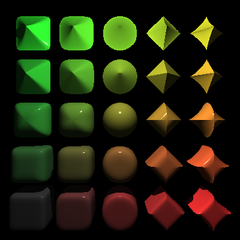
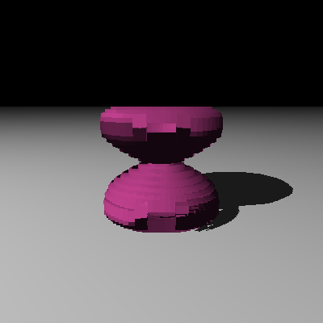

# Purpose

This is a library that is intended to be used to generate ray traced scenes. I had originally implemented this in Clojure but I wanted to learn more about Swift by reimplementing it in that language. It's a library instead of an application like POV-Ray, but there is a component in it that allows you to easily create an object scene by expressing it in a Swift DSL, and then render it to a file. Moreover, since you can use Xcode to type in a scene, you can take advantage of its own features like type-checking and fixits, which were not possible using Clojure. We're effectively using Xcode as a GUI for running a set of sketches. As with the Clojure implementation, this one is based on the tests provided by the amazing book, The Ray Tracer Challenge by Jamis Buck.

# Quick start

* Open Xcode
* Create a new project, using the Command Line Tool template
* Add this library, via File -> Add Packages...
  * Enter the URL of this repo, https://github.com/quephird/ScintillaLib, in the search field
  * Click the Add Package button in the main dialog box
  * Click the Add Package button in the new confirmation dialog box
  * Observe that ScintillaLib is now in the list under Package Dependencies in the Project Navigator
* Delete main.swift
* Create a new Swift file, say QuickStart.swift and add the following code:

```swift
import ScintillaLib

@main
struct QuickStart: ScintillaApp {
    var world = World {
        Camera(width: 400,
               height: 400,
               viewAngle: PI/3,
               from: Point(0, 2, -2),
               to: Point(0, 0, 0),
               up: Vector(0, 1, 0))
        PointLight(position: Point(-10, 10, -10))
        Sphere()
            .material(.solidColor(1, 0, 0))
    }
}
```

* Ensure that the project builds via Product -> Build
* Run the project and observe that a window pops open with an image that looks like this:


* Also observe that a new file, `QuickStart.png`, now exists on your desktop


# Features

Scintilla allows you to describe and render scenes using a light source, a camera, and a collection of shapes, each shape having an associated material. Shapes can then be combined with each other using constructive solid geometry. Below is a discussion on each of these features.

## Primitive shapes

The following primitive shapes are available:

| Shape | Defaults |
| --- | --- |
| Plane | Lies in the xz-plane |
| Sphere | Centered at the origin and has radius of one unit |
| Cube | Centered at the origin and has "radius" of one unit |
| Cone | Centered at the origin, has radius of one unit and infinite length along the y-axis, and has exposed caps |
| Cylinder | Centered at the origin, has radius of one unit and infinite length along the y-axis, and has exposed caps |
| Torus | Centered at the origin, lies in the xz-plane, had major radius of two and a minor radius of one |

Currently, all shapes must minimally be constructed with a `Material`, the details of which explained below.

All shapes also have the following property modifiers for setting/updating the underlying transformation matrix:

* `translate(_ x: Double, _ y: Double, _ z: Double)`
* `scale(_ x: Double, _ y: Double, _ z: Double)`
* `rotateX(_ t: Double)`
* `rotateY(_ t: Double)`
* `rotateZ(_ t: Double)`
* `shear(_ xy: Double, _ xz: Double, _ yx: Double, _ yz: Double, _ zx: Double, _ zy: Double)`

This means that you can chain operations together in a logical manner and not have to explicitly `let` out a transformation matrix and then pass it in to the shape's constructor, like this:

```swift
Cube()
    .shear(1, 1, 0, 1, 0, 0)
    .scale(1, 2, 3)
    .rotateX(PI/3)
    .rotateY(PI/3)
    .rotateZ(PI/3)
    .translate(0, 1, 2)
```

The implementation applies the underlying transformation matrices in reverse order, so the programmer isn't burdened with those details and instead can simply chain operations in an intuitive manner.

## Superellipsoids

Superellisoids are a family of surfaces with a wide range of diversity of shapes, governed by two parameters, `e` and `n` in the following equation:

<p align="center">
(|x|<sup>2/e</sup> + |y|<sup>2/e</sup>)<sup>e/n</sup> + z<sup>2/n</sup> = 1
</p>

Below is a rendering of an array of superellipsoids, each with a distinct combination of values for `e` and `n`:

```swift
import ScintillaLib

@main
struct SuperellipsoidScene: ScintillaApp {
    var world: World = World {
        Camera(width: 400,
               height: 400,
               viewAngle: PI/3,
               from: Point(0, 0, -12),
               to: Point(0, 0, 0),
               up: Vector(0, 1, 0))
        PointLight(position: Point(0, 5, -5))
        for (i, e) in [0.25, 0.5, 1.0, 2.0, 2.5].enumerated() {
            for (j, n) in [0.25, 0.5, 1.0, 2.0, 2.5].enumerated() {
                Superellipsoid(e: e, n: n)
                    .material(.solidColor((Double(i)+1.0)/5.0, (Double(j)+1.0)/5.0, 0.2))
                    .translate(2.5*(Double(i)-2.0), 2.5*(Double(j)-2.0), 0.0)
            }
        }
    }
}
```

They too are used just like any of the primitive shapes.



## Implicit surfaces

Implicit surfaces are actually a subclass of `Shape` but are used a little differently from the other types. Implicit surfaces are created with a material _and_ a closure that represents the function F in the equation that defines the surface in terms of the three coordinates, namely:

<p align="center">
F(x, y, z) = 0
</p>

Since it is not possible to compute the bounds of an arbitrary choice of F, Scintilla needs to somehow be informed of them. You can specify them by passing in a pair of 3-tuples representing the bottom-left-front and top-right-rear corners of a bounding box. If you do not, Scintilla defaults to a bounding box defined by (-1, -1, -1) and (1, 1, 1). Below is example code for rendering an implicit surface with an explicit bounding box for the equation:

<p align="center">
x² + y² + z² + sin(4x) + sin(4y) + sin(4z) = 1
</p>

```swift
import Darwin
import ScintillaLib

@main
struct MyWorld: ScintillaApp {
    var world = World {
        Camera(width: 400,
               height: 400,
               viewAngle: PI/3,
               from: Point(0, 0, -5),
               to: Point(0, 0, 0),
               up: Vector(0, 1, 0))
        PointLight(position: Point(-10, 10, -10))
        ImplicitSurface(bottomFrontLeft: (-2, -2, -2),
                        topBackRight: (2, 2, 2), { x, y, z in
            x*x + y*y + z*z + sin(4*x) + sin(4*y) + sin(4*z) - 1
        })
            .material(.solidColor(0.2, 1, 0.5))
    }
}
```

... and here is what that looks like:


You can also specify a bounding sphere by passing in a 3-tuple representing the center of the sphere, and a single double value representing its radius. This can be useful for implicit surfaces which have spherical symmetry, such as the  Barth sextic below. (φ is the golden ratio, 1.61833987...)

<p align="center">
4(φ²x² - y²)(φ²y² - z²)(φ²z² - x²) - (1 + 2φ)(x² + y² + z² - 1)² = 0
</p>


```swift
import Darwin
import ScintillaLib

let φ: Double = 1.61833987

@main
struct MyImplicitSurface: ScintillaApp {
    var world: World {
        Camera(width: 400,
               height: 400,
               viewAngle: PI/3,
               from: Point(0, 0, -5),
               to: Point(0, 0, 0),
               up: Vector(0, 1, 0))
        PointLight(position: Point(-5, 5, -5))
        ImplicitSurface(center: (0.0, 0.0, 0.0),
                        radius: 2.0) { x, y, z in
            4.0*(φ*φ*x*x-y*y)*(φ*φ*y*y-z*z)*(φ*φ*z*z-x*x) - (1.0+2.0*φ)*(x*x+y*y+z*z-1.0)*(x*x+y*y+z*z-1.0)
        }
            .material(.solidColor(0.9, 0.9, 0.0))
    }
}

```


Implicit surfaces can be used just like any other primitive shape; they can be translated, scaled, and rotated, and all of their material properties work the same way as well.

## Parametric surfaces

Parametric surfaces are also a subclass of `Shape` and are also used a little differently from the other primitives. Like implicit surfaces, you need to specify a bounding box with two 3-tuples representing the bottom-left-front and top-right-back corners. And likewise, if not specified, the bounding box defaults to the cube formed by (-1, -1, -1) and (1, 1, 1).

However, unlike implicit surfaces, parametric surfaces are expressed with _three_ closures taking two parameters, one for each of the coordinates. For example, an hourglass like surface is defined by the following parametric functions:

<p align="center">
  x(u, v) = cos(u)sin(2v)<br />
  y(u, v) = sin(v)<br />
  z(u, v) = sin(u)sin(2v)<br />
</p>

... and this can be expressed in Scintilla like the following:

```swift
import Darwin
import ScintillaLib

@main
struct Hourglass: ScintillaApp {
    var world = World {
        Camera(width: 400,
               height: 400,
               viewAngle: PI/3,
               from: Point(0, 1, -5),
               to: Point(0, 0, 0),
               up: Vector(0, 1, 0))
        PointLight(position: Point(-10, 10, -10))
        ParametricSurface(bottomFrontLeft: (-1.0, -1.0, -1.0),
                          topBackRight: (1.0, 1.0, 1.0),
                          uRange: (0, 2*PI),
                          vRange: (0, 2*PI),
                          fx: { (u, v) in cos(u)*sin(2*v) },
                          fy: { (u, v) in sin(v) },
                          fz: { (u, v) in sin(u)*sin(2*v) })
            .material(.solidColor(0.9, 0.5, 0.5, .hsl))
        Plane()
            .material(.solidColor(1, 1, 1))
            .translate(0, -1.0, 0)
    }
}
```

... which results in an image like the following:


There are two other parameters that can be tweaked to improve the quality of the image for a parametric surface: the accuracy and the maximum gradient. They are passed in after the ranges of `u` and `v` values and before the three closures for `x`, `y`, and `z`. Both values also have default values— 0.001 for accuracy and 1.0 for the maximum gradient— so you do not always need to specify them. However, sometimes the resultant images for certain parametric surfaces can be too jaggy and so you may need to reduce the accuracy parameter. This is somewhat of a contrived example but below we have made the accuracy significantly larger (0.1) than the default value...

```swift
import Darwin
import ScintillaLib

@main
struct Hourglass: ScintillaApp {
    var world = World {
        Camera(width: 400,
               height: 400,
               viewAngle: PI/3,
               from: Point(0, 1, -5),
               to: Point(0, 0, 0),
               up: Vector(0, 1, 0))
        PointLight(position: Point(-10, 10, -10))
        ParametricSurface(bottomFrontLeft: (-1.0, -1.0, -1.0),
                          topBackRight: (1.0, 1.0, 1.0),
                          uRange: (0, 2*PI),
                          vRange: (0, 2*PI),
                          accuracy: 0.1,
                          maxGradient: 1.0,
                          fx: { (u, v) in cos(u)*sin(2*v) },
                          fy: { (u, v) in sin(v) },
                          fz: { (u, v) in sin(u)*sin(2*v) })
            .material(.solidColor(0.9, 0.5, 0.5, .hsl))
        Plane()
            .material(.solidColor(1, 1, 1))
            .translate(0, -1.0, 0)
    }
}
```
... and we can clearly see that it causes the shape to appear very blocky:



One thing to remember: smaller values of accuracy mean both a higher quality rendering as well as increased time to render.

Similarly, you may need to override the default value of the maximum gradient to  increase the fidelity of certain parametric surfaces. Generally speaking, the maximum gradient affects how Scintilla handles the bendiness of shapes; for less curvy shapes, you can get away with lower values of the max gradient, but for more curvy shapes, using too _low_ a value can cause parts of certain shapes to "drop" out.

(Specifically, the max gradient is an estimate of the maximum value of all the partial derivatives of the parametic functions at each point, namely `∂x/∂u`, `∂x/∂v`, `∂y/∂u`, `∂y/∂v`, `∂z/∂u`, and `∂z/∂v`. It is used to compute the minimum and maximum values of each coordinate for a given range of values for `u` and `v`, which ultimately is done when searching for a point of intersection by each ray from the camera toward the shape. If you are not sure how to choose an optimal value, you should start with the default value (1.0) and keep experimenting by raising or lowering it to find the lowest value that does not create unwanted artifacts.)

As an example, below we have taken our shape from above of and set the maximum gradient set to 0.3:

```swift
import Darwin
import ScintillaLib

@main
struct Hourglass: ScintillaApp {
    var world = World {
        Camera(width: 400,
               height: 400,
               viewAngle: PI/3,
               from: Point(0, 1, -5),
               to: Point(0, 0, 0),
               up: Vector(0, 1, 0))
        PointLight(position: Point(-10, 10, -10))
        ParametricSurface(bottomFrontLeft: (-1.0, -1.0, -1.0),
                          topBackRight: (1.0, 1.0, 1.0),
                          uRange: (0, 2*PI),
                          vRange: (0, 2*PI),
                          accuracy: 0.001,
                          maxGradient: 0.3,
                          fx: { (u, v) in cos(u)*sin(2*v) },
                          fy: { (u, v) in sin(v) },
                          fz: { (u, v) in sin(u)*sin(2*v) })
            .material(.solidColor(0.9, 0.5, 0.5, .hsl))
        Plane()
            .material(.solidColor(1, 1, 1))
            .translate(0, -1.0, 0)
    }
}
```

... and we can see that we have chosen a value that is too small, and see that we are missing significant parts of the shape:


It should be noted that even using the default values for accuracy and maximum gradient, parametric surfaces can take _significantly_ longer to render than implicit surfaces. However, there are many surfaces that cannot possibly (or easily) be expressed with an implicit function, and so using parametric surfaces can open up lots of possibilities.

## Prisms

Another `Shape` type that is available in Scintilla is the `Prism` object. To use a prism you need to pass in three parameters to the constructor:

* The base y-value
* The top y-value
* An array of tuples of `Double`s representing (x, z) coordinates of the vertices of a polygon 

The shape is extruded along the y-axis starting from the base y-value to the top one. Here is an example of a star-based prism:

```swift
import ScintillaLib

@main
struct PrismScene: ScintillaApp {
    var world: World {
        Camera(width: 400,
               height: 400,
               viewAngle: PI/3,
               from: Point(0, 5, -5),
               to: Point(0, 1, 0),
               up: Vector(0, 1, 0))
        PointLight(position: Point(-5, 5, -5))
        Prism(bottomY: 0.0,
              topY: 2.0,
              xzPoints: [(1.0, 0.0),
                         (1.5, 0.5),
                         (0.5, 0.5),
                         (0.0, 1.0),
                         (-0.5, 0.5),
                         (-1.5, 0.5),
                         (-1.0, 0.0),
                         (-1.0, -1.0),
                         (0.0, -0.5),
                         (1.0, -1.0)])
            .material(.solidColor(1, 0.5, 0))
        Plane()
            .material(.solidColor(1, 1, 1))
    }
}
```


For now, only line segments joining the vertices are supported; perhaps in the future Beziér curves can be. Nonetheless, both convex _and_ concave polygons are fully supported.

## Surfaces of revolution

Scintilla also makes available a surface-of-revolution shape. It takes up to two parameters:

* An array of tuples of `Double`s representing the (y, z) coordinates of vertices of the curve to be revolved about the y-axis
* A boolean value indicating whether or not caps at the top and bottom of the shape should be filled. The default value is `false`

Upon rendering, Scintilla computes a piecewise-continuous cubic spline function connecting the vertices, and effectively rotates that curve around the y-axis. This shape is very useful for creating things like vases or other curvy objects, like the one shown below.

```swift
import ScintillaLib

@main
struct SorScene: ScintillaApp {
    var world = World {
        Camera(width: 400,
               height: 400,
               viewAngle: PI/3,
               from: Point(0, 7, -10),
               to: Point(0, 2, 0),
               up: Vector(0, 1, 0))
        PointLight(position: Point(-5, 5, -5))
        SurfaceOfRevolution(yzPoints: [(0.0, 2.0),
                                       (1.0, 2.0),
                                       (2.0, 1.0),
                                       (3.0, 0.5),
                                       (6.0, 0.5)])
            .material(.solidColor(0.5, 0.6, 0.8))
        Plane()
            .material(.solidColor(1, 1, 1))
    }
}
```


As of this writing, only the cubic spline strategy is available for interpolating vertices.

## Materials

Currently materials employ either of the following color schemes:

* a solid color
* a repeating pattern
* a color function which takes an x, y, and z values and returns a tuple representing the RGB values of a color

Additionally, all material types carry the following attributes:

| Property | Range of values |
| --- | --- |
| ambient reflectance | 0.0 - 1.0 |
| diffuse reflectance | 0.0 - 1.0 |
| specular reflectance | 0.0 - 1.0 |
| shininess | 0.0 - ∞ |
| reflective index | 0.0 - 1.0 |
| transparency | 0.0 - 1.0 |
| refractive index | 1.0 - 2.5|

There is a default material, `SolidColor.basicMaterial()`, that can be used as a convenience, with default values for all of the attributes above and a solid white coloring scheme. Like `Shape`, `Material` has property modifers which can be used to specify values for the other attributes without having to pass non-default values for them all at once:

* `.ambient(_ n: Double)`
* `.diffuse(_ n: Double)`
* `.specular(_ n: Double)`
* `.shininess(_ n: Double)`
* `.reflective(_ n: Double)`
* `.transparency(_ n: Double)`
* `.refractive(_ n: Double)`

To associate a material with a `Shape`, you call the `.material()` property modifier and pass in a `Material` instance. There are three static methods that are provided as a convenience to accomplish this:

* `.solidColor(_ r: Double, _ g: Double, _ b: Double)`
* `.pattern(_ pattern: Pattern)`
* `.colorFunction(_ f: ColorFunctionType)`

For example, to create a 3D checkered pattern for a cube, you can write the following:

```swift
Cube()
    .material(.pattern(Checkered3D(.white, .black, .identity)))
```

The following patterns are available in Scintilla:

* Stripes
`Striped(_ firstColor: Color, _ secondColor: Color, _ transform: Matrix4)`


* 2D checkerboard
`Checkered2D(_ firstColor: Color, _ secondColor: Color, _ transform: Matrix4)`


* 3D checkerboard
`Checkered3D(_ firstColor: Color, _ secondColor: Color, _ transform: Matrix4)`


* Gradient
`Gradient(_ firstColor: Color, _ secondColor: Color, _ transform: Matrix4)`


Alternatively, to use a color function, you can do this:

```swift
Cube()
    .material(.colorFunction({ x, y, z in
        (abs(sin(x)), abs(sin(y)), abs(sin(z)))
    }))
```


Colors can be expressed in both RGB and HSL color spaces. By default, colors are constructed in the RGB color space; if you want to use the HSL space for a material with a solid color, you can pass in the `.hsl` enum case like in the following:

```swift
Sphere()
    .translate(0, 1, 0)
    .material(.solidColor(0.5, 1.0, 0.5, .hsl))
```


You can also use the HSL color space for a material that uses a color function, like this:

```swift
Sphere()
    .material(.colorFunction(.hsl) { x, y, z in
        ((atan(z/x)+PI/2.0)/PI, 1.0, 0.5)
    })

```


## Constructive solid geometry

There are three supported operations for combining various shapes:

* Union
* Intersection
* Difference

The implementation for CSG takes advantage of so-called result builders, a feature of Swift that allows the programmer to list parameters to a function with minimal punctuation. Furthermore, Scintilla is responsible for nesting pairs of CSG operations so you don't have to, and so you can express the subtraction of three cylinders from a sphere like this:

```swift
Sphere()
    .material(.solidColor(Color(0, 0, 1)))
    .difference {
        Cylinder()
            .material(.solidColor(0, 1, 0))
            .scale(0.6, 0.6, 0.6)
        Cylinder()
            .material(.solidColor(0, 1, 0))
            .scale(0.6, 0.6, 0.6)
            .rotateZ(PI/2)
        Cylinder()
            .material(.solidColor(0, 1, 0))
            .scale(0.6, 0.6, 0.6)
            .rotateX(PI/2)
    }
```

... instead of having to do this:

```swift
CSG(.difference,
    CSG(.difference,
        CSG(.difference,
            Sphere()
                .material(.solidColor(0, 0, 1))),
            Cylinder()
                .material(.solidColor(0, 1, 0))
                .scale(0.5, 0.5, 0.5)),
        Cylinder()
            .material(.solidColor(0, 1, 0))
            .scale(0.5, 0.5, 0.5)
            .rotateZ(PI/2)),
    Cylinder()
        .material(.solidColor(0, 1, 0))
        .scale(0.5, 0.5, 0.5)
        .rotateX(PI/2))
```

You can even use `for` loops in the middle of an expression to accomplish the same:

```swift
Sphere()
    .material(.solidColor(0, 0, 1))
    .difference {
        for (thetaX, thetaZ) in [(0, 0), (0, PI/2), (PI/2, 0)] {
            Cylinder()
                .material(.solidColor(0, 1, 0))
                .scale(0.6, 0.6, 0.6)
                .rotateX(thetaX)
                .rotateZ(thetaZ)
        }
    }
```

You can also chain calls to `.union()`, `.intersection()`, and `.difference()` to create complex shapes:

```swift
Sphere()
    .material(.solidColor(0, 0, 1))
    .intersection {
        Cube()
            .material(.solidColor(1, 0, 0))
            .scale(0.8, 0.8, 0.8)
    }
    .difference {
        for (thetaX, thetaZ) in [(0, 0), (0, PI/2), (PI/2, 0)] {
            Cylinder()
                .material(.solidColor(0, 1, 0))
                .scale(0.5, 0.5, 0.5)
                .rotateX(thetaX)
                .rotateZ(thetaZ)
        }
    }
```


## Lights

Scintilla currently supports two kinds of `Light`s: `PointLight` and `AreaLight`. `PointLight` minimally requires a position to be constructed and defaults to a white color if no other one is specified. Light rays emanate from a single point, the `PointLight`'s position, and are cast on the world.

`AreaLight`s require more information in order to be constructed:

| Parameter name | Description |
| --- | --- |
| `corner` | a `Tuple4` object which represents the x, y, and z coordinates of the corner of the light source |
| `color` | the `Color` of the light source |
| `fullUVec` | a `Tuple4` object representing the direction and size of one dimension of the light source |
| `uSteps` | the number of subdivisions along the vector defined by `fullUVec` | 
| `fullVVec` | a `Tuple4` object representing the direction and magnitude of the second dimension of the light source |
| `vSteps` | the number of subdivisions along the vector defined by `fullVVec` | 

The following diagram might make it clearer to understand what the parameters represent:

```
                            --------- fullVVec ------->

                    ^      |------|------|------|------|
                    |      |      | *    |      |  *   |
                    |      | *    |      |   *  |      |
                    |      |------|------|------|------|
                    |      |      |      |  *   |     *|
                fullUVec   |    * |  *   |      |      |
                    |      |------|------|------|------|
                    |      |      |   *  |   *  |      |
                    |      |  *   |      |      |*     |
                    |      |------|------|------|------|

                        corner

```
Instead of a single point source of light, an `AreaLight` can be thought of as a rectangular one being composed of multiple cells, `uSteps`*`vSteps` in number. For each pixel to be rendered in the scene, a ray is cast from each of the cells, the position of which is randomly "jittered" from the center of each one, indicated above by asterisks. The colors associated with each light ray are then averaged and assigned to each pixel in the scene, the primary result of which is softer shadows of objects. You can see the stark difference below.

A scene rendered with a point light:


A scene rendered with an area light at the same position as the point light above, but with 10 subdivisions along two dimensions:

```swift
import ScintillaLib

@main
struct MyWorld: ScintillaApp {
    var world: World {
        Camera(width: 400,
               height: 400,
               viewAngle: PI/3,
               from: Point(0, 2, -5),
               to: Point(0, 1, 0),
               up: Vector(0, 1, 0))
        AreaLight(corner: Point(-5, 5, -5),
                  uVec: Vector(2, 0, 0),
                  uSteps: 10,
                  vVec: Vector(0, 2, 0),
                  vSteps: 10)
        Sphere()
            .translate(0, 1, 0)
            .material(.solidColor(1, 0, 0))
        Plane()
            .material(.solidColor(1, 1, 1))
    }
}
```


**NOTA BENE**: Using an `AreaLight` results in longer rendering times that are proportional to the values of the `uSteps` and `vSteps` parameters.

You can also have multiple lights, which you can use to create scenes with multiple shadows and/or give shapes more highlights. Below is a pasta-like shape with two light sources, one to the left and one to the right:

```
import Darwin
import ScintillaLib

@available(macOS 12.0, *)
@main
struct Cavatappi: ScintillaApp {
    var world = World {
        Camera(width: 400,
               height: 400,
               viewAngle: PI/3,
               from: Point(0, 7, -15),
               to: Point(0, 7, 0),
               up: Vector(0, 1, 0))
        PointLight(position: Point(-10, 10, -10))
        PointLight(position: Point(10, 10, -10))
        ParametricSurface(bottomFrontLeft: (-3.5, 0, -3.5),
                          topBackRight: (3.5, 15.0, 3.5),
                          uRange: (0, 2*PI),
                          vRange: (0, 7*PI),
                          accuracy: 0.001,
                          maxGradient: 1.0,
                          fx: { (u, v) in (2 + cos(u) + 0.1*cos(8*u))*cos(v) },
                          fy: { (u, v) in 2 + sin(u) + 0.1*sin(8*u) + 0.5*v },
                          fz: { (u, v) in (2 + cos(u) + 0.1*cos(8*u))*sin(v) })
            .material(.solidColor(1.0, 0.8, 0))
        Plane()
            .material(.solidColor(1, 1, 1))
            .translate(0, -3.0, 0)
    }
}
```

... and the result is quite dramatic:


Lights can also be configured to fade over the distance travelled to objects in the scene. You can use the optional `fadeDistance` parameter to govern how sharply the light intensity fades; larger values mean that light takes more distance to fade, smaller ones result in a sharper dropoff.

```
import ScintillaLib

@available(macOS 12.0, *)
@main
struct DimlyLitScene: ScintillaApp {
    var world = World {
        Camera(width: 400,
               height: 400,
               viewAngle: PI/3,
               from: Point(0, 0, -5),
               to: Point(0, 0, 0),
               up: Vector(0, 1, 0))
        PointLight(position: Point(-10, 10, 0),
                   fadeDistance: 10)
        Sphere()
            .material(.solidColor(1, 0.5, 0))
        Plane()
            .translate(0, -1, 0)
    }
}
```


As with the accuracy and max gradient parameters for parametric surfaces, you might have to experiment with various values in order to get the effect you want.

## Constructing a scene

To construct a scene, you need to create a `World` instance with the following objects

* one `Camera`
* one or more `Light`s
* one or more `Shape`s

Lights and shapes are discussed above. A `Camera` takes the following four arguments:

* the width of the resultant image in pixels
* the height of the resultant image in pixels
* the solid angle in radians specifying the field of view
* the point designating its origin
* the point designating where it is pointing at
* the vector representing which way is up.

`World` also supports enumerating shapes using result builders, so you can do the following:

```swift
World {
    Camera(width: 800,
           height: 600,
           viewAngle: PI/3,
           from: Point(0, 3, -5),
           to: Point(0, 0, 0),
           up: Vector(0, 1, 0))
    PointLight(position: Point(-10, 10, -10))
    Sphere()
        .material(.solidColor(1, 0, 0))
        .translate(-2, 0, 0)
    Sphere()
        .material(.solidColor(0, 1, 0))
    Sphere()
        .material(.solidColor(0, 0, 1))
        .translate(2, 0, 0)
```

Note the lack of commas separating the parameters to the `World` constructor as well as not needing brackets around the `Sphere` objects.

## Rendering a scene

Scintilla comes with a component that allows you to easily create an application and render a scene. In order to do this, first create a new Xcode project, using the Command Line Tool template. 


Next add Scintilla as a package dependency via File -> Add Packages; in that dialog box, enter the URL of this Git repository and click Add Package. Xcode should successfully download the library and add it to the project.

Now that you're ready to use Scintilla, all you need to do is create a new Swift file, say `MyWorld.swift`. Add the following code as an example scene:

```swift
import ScintillaLib

@main
struct MyWorld: ScintillaApp {
    var world = World {
        Camera(width: 800,
               height: 600,
               viewAngle: PI/3,
               from: Point(0, 1, -2),
               to: Point(0, 0, 0),
               up: Vector(0, 1, 0))
        PointLight(position: Point(-10, 10, -10))
        Sphere()
            .material(.solidColor(0, 0, 1))
            .intersection {
                Cube()
                    .material(.solidColor(1, 0, 0))
                    .scale(0.8, 0.8, 0.8)
            }
            .difference {
                for (thetaX, thetaZ) in [(0, 0), (0, PI/2), (PI/2, 0)] {
                    Cylinder()
                        .material(.solidColor(0, 1, 0))
                        .scale(0.5, 0.5, 0.5)
                        .rotateX(thetaX)
                        .rotateZ(thetaZ)
                }
            }
            .rotateY(PI/6)
    }
}
```

Please note the following about the example above:

* You must `import ScintillaLib`
* You need to annotate the struct with `@main`
* Your struct must conform to the `ScintallaApp` protocol
* The struct must have the `world` property, which is of type `World`

If you've done all that, you now have a bona fide application and should be able to run it through Xcode. And if all goes well, you should see a window open with the rendered image, and the file `MyWorld.png` on your desktop.

You can also optionally render a scene with antialiasing. In the image above, you can see that the various edges of the object are pretty jagged and take away from the verisimilitude of the image. By adding a property modifier to the `World` object, `.antialiasing(true)`, we can improve its quality:

```
import Darwin
import ScintillaLib

@available(macOS 12.0, *)
@main
struct Cavatappi: ScintillaApp {
    var world = World {
        Camera(width: 400,
               height: 400,
               viewAngle: PI/3,
               from: Point(0, 7, -15),
               to: Point(0, 7, 0),
               up: Vector(0, 1, 0),
               antialiasing: true)
        PointLight(position: Point(-10, 10, -10))
        PointLight(position: Point(10, 10, -10))
        ParametricSurface(bottomFrontLeft: (-3.5, 0, -3.5),
                          topBackRight: (3.5, 15.0, 3.5),
                          uRange: (0, 2*PI),
                          vRange: (0, 7*PI),
                          accuracy: 0.001,
                          maxGradient: 1.0,
                          fx: { (u, v) in (2 + cos(u) + 0.1*cos(8*u))*cos(v) },
                          fy: { (u, v) in 2 + sin(u) + 0.1*sin(8*u) + 0.5*v },
                          fz: { (u, v) in (2 + cos(u) + 0.1*cos(8*u))*sin(v) })
            .material(.solidColor(1.0, 0.8, 0))
        Plane()
            .material(.solidColor(1, 1, 1))
            .translate(0, -3.0, 0)
    }
}
```

... and below is the resultant image:


You should be able to see that it is far less "jaggy" than the orignal image shown further up in this README.

Because rendering times are much slower with antialiasing turned on, you should make sure that the run configuration is set to Release in order to run Swift in the fastest fashion. To get there, go to Product -> Scheme -> Edit Scheme...


## Adding new scenes

You can have multiple scenes in a single project by adding new targets via File -> New -> Target... Just make sure that ScintillaLib is included as a library in the target; go to the project navigator, click on the project name, then the target name in the editor pane, then the General tab.


## Examples

You will find quite a few example scenes in the top-level `Examples` folder of this repo. You should be able to run them directly in Xcode after after cloning and opening this repo.

## Relevant links

* The Ray Tracer Challenge by Jamis Buck  
  [https://pragprog.com/titles/jbtracer/the-ray-tracer-challenge/](https://pragprog.com/titles/jbtracer/the-ray-tracer-challenge/)
* Result builders  
  [https://docs.swift.org/swift-book/LanguageGuide/AdvancedOperators.html#ID630](https://docs.swift.org/swift-book/LanguageGuide/AdvancedOperators.html#ID630)
