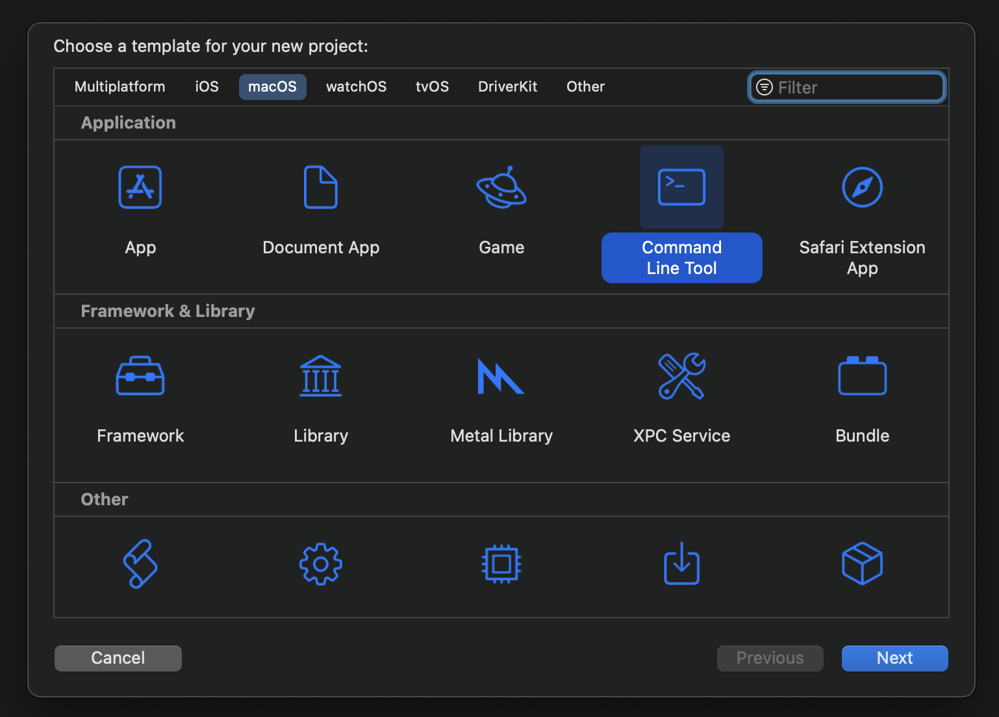

# Purpose

This is a library that is intended to be used to generate ray traced scenes. I had originally implemented this in Clojure but I wanted to learn more about Swift by reimplementing it in that language. It's a library instead of an application like POV-Ray, but there is a component in it that allows you to easily create an object scene by expressing it in a Swift DSL, and then render it to a file. Moreover, since you can use Xcode to type in a scene, you can take advantage of its own features like type-checking and fixits, which were not possible using Clojure. As with the Clojure implementation, this one is based on the tests provided by the amazing book, The Ray Tracer Challenge by Jamis Buck.

# Features

## Shapes

The following shapes are available:

| Shape | Defaults |
| --- | --- |
| Plane | Lies in the xz-plane |
| Sphere | Centered at the origin and has radius of one unit |
| Cube | Centered at the origin and has "radius" of one unit |
| Cone | Centered at the origin, has radius of one unit and infinite length along the y-axis, and has exposed caps |
| Cylinder | Centered at the origin, has radius of one unit and infinite length along the y-axis, and has exposed caps |
| Torus | Centered at the origin, lies in the xz-plane, had major radius of two and a minor radius of one |

Currently, all shapes must minimally be constructed with a `Material`, the details of which explained below.

All shapes also have the following property modifiers for setting/updating the underlying transformation matrix:

* `translate(_ x: Double, _ y: Double, _ z: Double)`
* `scale(_ x: Double, _ y: Double, _ z: Double)`
* `rotateX(_ t: Double)`
* `rotateY(_ t: Double)`
* `rotateZ(_ t: Double)`
* `shear(_ xy: Double, _ xz: Double, _ yx: Double, _ yz: Double, _ zx: Double, _ zy: Double)`

This means that you can chain operations together in a logical manner and not have to explicitly `let` out a transformation matrix and then pass it in to the shape's constructor, like this:

```
Cube(.basicMaterial())
    .shear(1, 1, 0, 1, 0, 0)
    .scale(1, 2, 3)
    .rotateX(PI/3)
    .rotateY(PI/3)
    .rotateZ(PI/3)
    .translate(0, 1, 2)
```

The implementation applies the underlying transformation matrices in reverse order, so the programmer isn't burdened with those details and instead can simply chain operations in an intuitive manner.

## Materials

Currently materials of shapes are either a solid color or a pattern. There are static methods on `Material` that make the instantiation of either slightly easier.

The following patterns are available:

* Stripes
`Pattern(_ firstColor: Color, _ secondColor: Color, _ transform: Matrix4)`


* 2D checkerboard
`Checkered2D(_ firstColor: Color, _ secondColor: Color, _ transform: Matrix4)`


* 3D checkerboard
`Checkered3D(_ firstColor: Color, _ secondColor: Color, _ transform: Matrix4)`


* Gradient
`Gradient(_ firstColor: Color, _ secondColor: Color, _ transform: Matrix4)`


## Constructive solid geometry

There are three supported operations for combining various shapes:

* Union
* Intersection
* Difference

The implementation for CSG takes advantage of so-called result builders, a feature of Swift that allows the programmer to list parameters to a function with minimal punctuation. Furthermore, Scintilla is responsible for nesting pairs of CSG operations so you don't have to, and so you can express the subtraction of three cylinders from a sphere like this:

```
Sphere(.solidColor(Color(0, 0, 1)))
    .difference {
        Cylinder(.solidColor(Color(0, 1, 0)))
            .scale(0.6, 0.6, 0.6)
        Cylinder(.solidColor(Color(0, 1, 0)))
            .scale(0.6, 0.6, 0.6)
            .rotateZ(PI/2)
        Cylinder(.solidColor(Color(0, 1, 0)))
            .scale(0.6, 0.6, 0.6)
            .rotateX(PI/2)
    }
```

You can even use `for` loops in the middle of an expression:

```
Sphere(.solidColor(Color(0, 0, 1)))
    .difference {
        for (thetaX, thetaZ) in [(0, 0), (0, PI/2), (PI/2, 0)] {
            Cylinder(.solidColor(Color(0, 1, 0)))
                .scale(0.6, 0.6, 0.6)
                .rotateX(thetaX)
                .rotateZ(thetaZ)
        }
    }
```

Both of the above result in the following rendering:


## Constructing a scene

To construct a scene, you need to create a `World` instance with the following objects

* a `Light`
* a `Camera`
* a body of `Shape`s

`World` also supports enumerating shapes using result builders, so you can do the following:

```
World {
    Light(point(-10, 10, -10))
    Camera(800, 600, PI/3, .view(
        point(0, 2, -5),
        point(0, 0, 0),
        vector(0, 1, 0)))
	Sphere(.solidColor(Color(0, 0, 1)))
	    .difference {
	        for (thetaX, thetaZ) in [(0, 0), (0, PI/2), (PI/2, 0)] {
	            Cylinder(.solidColor(Color(0, 1, 0)))
	                .scale(0.6, 0.6, 0.6)
	                .rotateX(thetaX)
	                .rotateZ(thetaZ)
	        }
	    }
```

Note the lack of commas separating the parameters to the `World` constructor as well as not needing brackets around the `Sphere` objects.

## Rendering a scene

Scintilla comes with a component that allows you to easily create an application and render a scene. In order to do this, first create a new Xcode project, using the Command Line Tool template. 



Next add Scintilla as a package dependency via File -> Add Packages; in that dialog box, enter the URL of this Git repository and click Add Package. Xcode should successfully download the library and add it to the project.

Now that you're ready to use Scintilla, all you need to do is create a new Swift file, say `MyWorld.swift`. Add the following code as an example scene:

```
import ScintillaLib

@main
struct MyWorld: ScintillaApp {
    var body: World {
        Light(point(-10, 10, -10))
        Camera(800, 600, PI/3, .view(
            point(0, 10, -15),
            point(0, 0, 0),
            vector(0, 1, 0)))
        Sphere(.solidColor(Color(0, 0, 1)))
            .difference {
                for (thetaX, thetaZ) in [(0, 0), (0, PI/2), (PI/2, 0)] {
                     Cylinder(.solidColor(Color(0, 1, 0)))
                         .scale(0.6, 0.6, 0.6)
                         .rotateX(thetaX)
                         .rotateZ(thetaZ)
                }
            }
    }
}
```

Please note the following about the example above:

* You must `import ScintillaLib`
* You need to annotate the struct with `@main`
* Your struct must conform to the `ScintallaApp` protocol
* The struct must have the `body` property, which is of type `World`

If you've done all that, you now have a bona fide application and should be able to run it through Xcode. And if all goes well, you should see the file `MyWorld.ppm` on your desktop.


## Relevant links

* The Ray Tracer Challenge by Jamis Buck  
  [https://pragprog.com/titles/jbtracer/the-ray-tracer-challenge/](https://pragprog.com/titles/jbtracer/the-ray-tracer-challenge/)
* Result builders  
  [https://docs.swift.org/swift-book/LanguageGuide/AdvancedOperators.html#ID630](https://docs.swift.org/swift-book/LanguageGuide/AdvancedOperators.html#ID630)